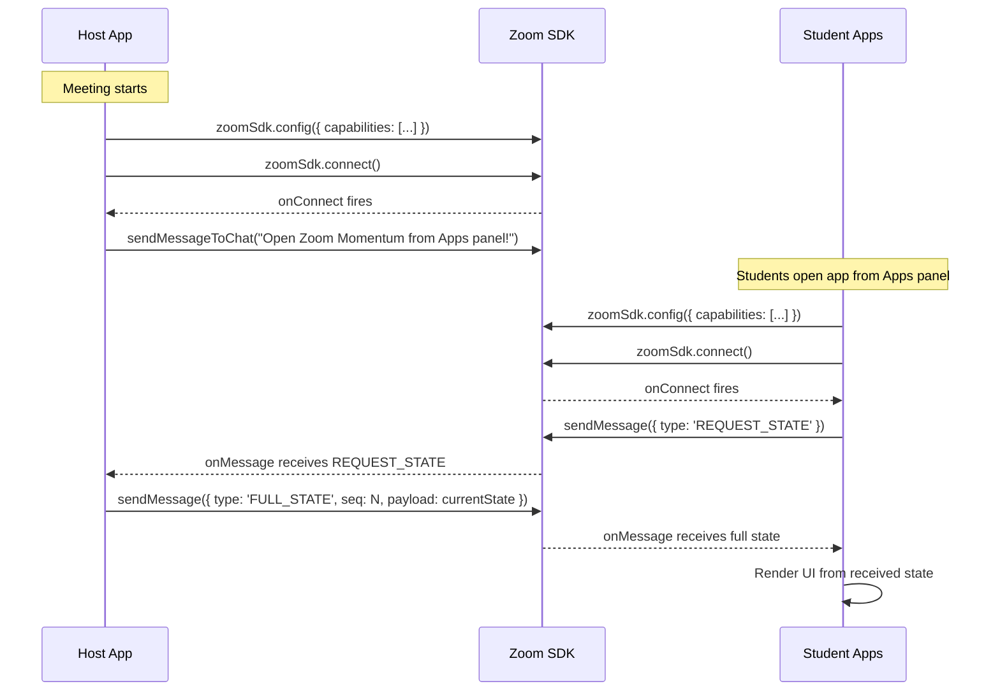
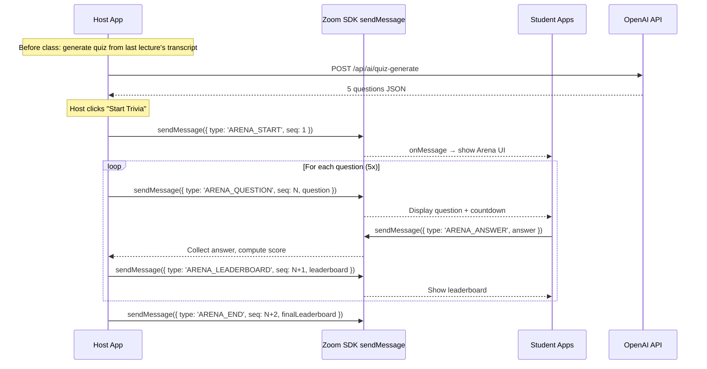
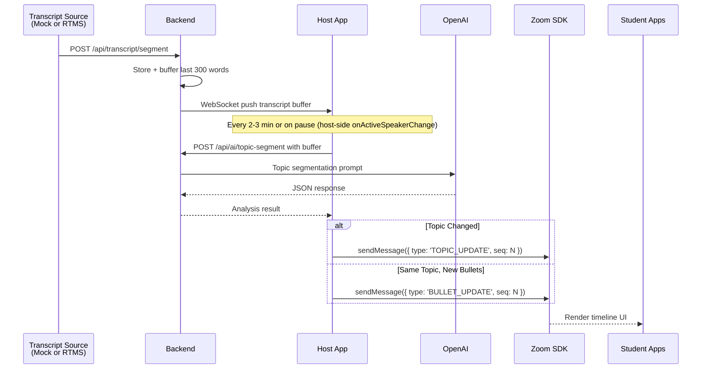
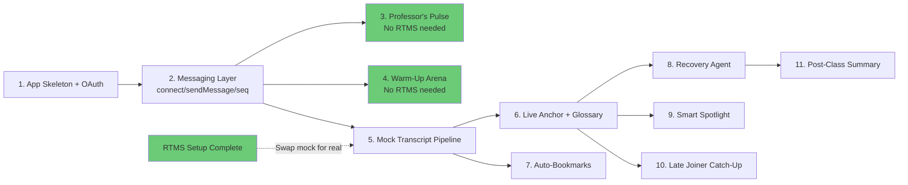

# Zoom Momentum — Technical Implementation Plan

## Architectural Decisions (Feb 2026 Feasibility Review)

After cross-referencing every API in the feature spec against the current Zoom developer platform, we've made the following binding decisions to simplify implementation.

### Decision 1: Use `connect` + `sendMessage` — Skip Collaborate Mode

**Context:** The Zoom SDK has two distinct systems: (a) `connect()` + `sendMessage()` / `onMessage()` for broadcasting messages to all participants with the app open, and (b) Collaborate Mode (`startCollaborate()` / `endCollaborate()`) for interactive shared screen experiences.

**Decision:** Use only `connect()` + `sendMessage()`. This is simpler, well-documented, and sufficient for our host-broadcasts-state pattern. Collaborate Mode adds complexity (review submission, `onCollaborateChange` events, `joinCollaborate` flows) with no clear benefit for our use case.

**Implications:**
- Students must manually open the app from the Apps panel (no auto-open)
- Host can send a chat message via `sendMessageToChat` prompting students to open the app
- Remove all references to `startCollaborate` / `endCollaborate` from the codebase

### Decision 2: All Detection Events Are Host-Only

**Context:** `onParticipantChange` and `getMeetingParticipants` are confirmed host-only for privacy reasons. `onActiveSpeakerChange` is reported to be limited to the meeting owner.

**Decision:** All detection logic runs exclusively on the host app. The host detects events and broadcasts results to students via `sendMessage`. Students never need these events.

**Implications:**
- Smart Spotlight: host detects speaker changes, host calls `addParticipantSpotlight`
- Late Joiner: host detects new participant, host broadcasts `FULL_STATE`
- Pause detection: host monitors `onActiveSpeakerChange`, host triggers AI analysis

### Decision 3: Sequence-Numbered Messages

**Context:** `sendMessage` guarantees delivery to current participants but does NOT guarantee delivery order.

**Decision:** Add a monotonically increasing `seq` number to every message. Clients buffer and reorder if needed. For the quiz (Warm-Up Arena), this prevents answer-before-question race conditions.

**Message envelope:**
```typescript
interface AppMessage {
  type: MessageType;
  payload: unknown;
  seq: number;       // monotonically increasing, set by host
  timestamp: number;
  senderId: string;
  senderRole: 'host' | 'student';
}
```

### Decision 4: Build Non-RTMS Features First (for Velocity)

**Context:** RTMS access is provided by Zoom (this is a Zoom-sponsored project). However, developing against live RTMS requires a running Zoom meeting, which slows iteration.

**Decision:** Build features in this order:
1. **Professor's Pulse** (simplest — only needs `sendMessage` + AI)
2. **Warm-Up Arena** (only needs `sendMessage` + AI)
3. **Live Anchor** with mock transcript pipeline (fast local dev, no live meeting needed)
4. **Recovery Agent** (depends on transcript data)
5. Wire up real RTMS for integration testing and production

### Decision 5: Mock Transcript Pipeline

**Decision:** Build a mock transcript service that simulates RTMS output (WebSocket transcript chunks) so Live Anchor, Glossary, Auto-Bookmarks, and Recovery Agent can all be developed and tested locally without a live Zoom meeting. The mock service has the same interface as the real RTMS pipeline, making the swap trivial.

### Decision 6: `sendMessage` Payload Budget

**Context:** Payload limit is **<512KB** per message (not 1KB as some old docs incorrectly state).

**Decision:** This is more than sufficient for all our use cases. A `FULL_STATE` message with 20 topics, 100 glossary entries, and leaderboard data fits comfortably under 50KB. No need for message chunking.

---

## API Reference (Verified Feb 2026)

### Confirmed APIs

| API | Status | Used For |
|---|---|---|
| `zoomSdk.config()` | ✅ | Init with capabilities list |
| `zoomSdk.connect()` | ✅ | Establish messaging channel |
| `zoomSdk.sendMessage()` / `postMessage()` | ✅ | Broadcast to all participants (<512KB) |
| `zoomSdk.onMessage()` | ✅ | Receive messages |
| `zoomSdk.onConnect()` | ✅ | Detect connection established |
| `zoomSdk.getUserContext()` | ✅ | Get user info + role |
| `zoomSdk.getMeetingParticipants()` | ✅ Host-only | Get participant count |
| `zoomSdk.onParticipantChange()` | ✅ Host-only | Detect joins/leaves |
| `zoomSdk.onActiveSpeakerChange()` | ✅ Host-only | Detect speaker changes |
| `zoomSdk.onMeeting()` | ✅ | Detect meeting end |
| `zoomSdk.onRunningContextChange()` | ✅ | Detect `inMeeting` → `inMainClient` |
| `zoomSdk.authorize()` / `onAuthorized()` | ✅ | OAuth PKCE flow |
| `zoomSdk.startRTMS()` | ✅ | Direct SDK method (GA June 2025) |
| `zoomSdk.stopRTMS()` / `getRTMSStatus()` / `onRTMSStatusChange()` | ✅ | RTMS lifecycle |
| `zoomSdk.addParticipantSpotlight()` | ✅ | Spotlight student (since SDK v0.16.7) |
| `zoomSdk.removeParticipantSpotlights()` | ✅ | Clear spotlights |
| `zoomSdk.showNotification()` | ✅ | Native Zoom notifications |
| `zoomSdk.sendMessageToChat()` | ✅ | Send chat message (prompt students to open app) |
| `@zoom/rtms` Node.js SDK | ✅ | RTMS WebSocket handling (access provided by Zoom) |

### APIs NOT Available

| API | Status | Alternative |
|---|---|---|
| `onTranscriptUpdate` | ❌ Does not exist | Use RTMS |
| Waiting room context | ❌ Not supported | Run Arena in-meeting |
| AI Companion generation | ❌ Not for 3rd-party apps | Use OpenAI/Gemini |
| `startCollaborate` | ⛔ Not using (Decision 1) | Use `connect` + `sendMessage` |

---

## Shared State Implementation

This is the backbone of the entire app. Every feature depends on this layer.

### How It Works

1. All participants call `connect()` on app init
2. Host app maintains canonical state
3. Host broadcasts state updates via `sendMessage()` (all messages carry `seq` numbers)
4. Students receive updates via `onMessage()` and render UI
5. Students send events (quiz answers, poll responses, bookmark actions) via `sendMessage()` back to host
6. Host processes events, updates state, broadcasts results

### Setup Flow



### Message Protocol

```typescript
type MessageType =
  // State sync
  | 'FULL_STATE'
  | 'REQUEST_STATE'
  // Arena
  | 'ARENA_START'
  | 'ARENA_QUESTION'
  | 'ARENA_ANSWER'
  | 'ARENA_LEADERBOARD'
  | 'ARENA_END'
  // Live Anchor
  | 'TOPIC_UPDATE'
  | 'BULLET_UPDATE'
  | 'GLOSSARY_UPDATE'
  // Professor's Pulse
  | 'POLL_START'
  | 'POLL_RESPONSE'
  | 'POLL_RESULTS';

interface AppMessage {
  type: MessageType;
  payload: unknown;
  seq: number;
  timestamp: number;
  senderId: string;
  senderRole: 'host' | 'student';
}
```

### State Structure

```typescript
interface AppState {
  phase: 'waiting' | 'arena' | 'lecture' | 'ended';

  arena: {
    active: boolean;
    currentQuestion: number;
    questions: Question[];
    answers: Map<string, Answer[]>;  // participantId → answers
    leaderboard: LeaderboardEntry[];
  };

  liveAnchor: {
    topics: Topic[];
    currentTopicId: string;
    glossary: GlossaryEntry[];
  };

  pulse: {
    activePoll: Poll | null;
    pollHistory: Poll[];
  };

  meeting: {
    id: string;
    startTime: number;
    participantCount: number;
  };
}
```

### useMessaging Hook

```javascript
// client/src/hooks/useMessaging.js
import { useEffect, useCallback, useRef, useState } from 'react';
import zoomSdk from '@zoom/appssdk';

export function useMessaging({ onMessage, isHost }) {
  const [connected, setConnected] = useState(false);
  const seqRef = useRef(0);       // Host: monotonic sequence counter
  const stateRef = useRef(null);   // Host: current canonical state

  useEffect(() => {
    const init = async () => {
      await zoomSdk.connect();
      setConnected(true);

      // If student, request current state on connect
      if (!isHost) {
        send({ type: 'REQUEST_STATE', payload: null });
      }
    };

    zoomSdk.onMessage((message) => {
      const parsed = JSON.parse(message.payload);

      // Host auto-responds to state requests
      if (isHost && parsed.type === 'REQUEST_STATE') {
        broadcast({ type: 'FULL_STATE', payload: stateRef.current });
        return;
      }

      onMessage(parsed);
    });

    // Host: detect new participants and auto-send state
    if (isHost) {
      zoomSdk.onParticipantChange((event) => {
        if (stateRef.current) {
          broadcast({ type: 'FULL_STATE', payload: stateRef.current });
        }
      });
    }

    init();
  }, [isHost, onMessage]);

  // Send a message (used by students for answers/responses)
  const send = useCallback((message) => {
    const full = {
      ...message,
      timestamp: Date.now(),
      senderRole: isHost ? 'host' : 'student',
    };
    zoomSdk.postMessage({ payload: JSON.stringify(full) });
  }, [isHost]);

  // Host-only: broadcast with sequence number
  const broadcast = useCallback((message) => {
    seqRef.current += 1;
    const full = {
      ...message,
      seq: seqRef.current,
      timestamp: Date.now(),
      senderRole: 'host',
    };
    zoomSdk.postMessage({ payload: JSON.stringify(full) });
  }, []);

  // Host: update canonical state reference
  const setState = useCallback((newState) => {
    stateRef.current = newState;
  }, []);

  return { connected, send, broadcast, setState };
}
```

---

## Technology Stack

| Layer | Technology | Purpose |
|---|---|---|
| **Frontend** | React 18 + `@zoom/appssdk` | UI in Zoom's embedded browser |
| **Backend** | Node.js + Express | OAuth, AI proxy, WebSocket server, REST API |
| **RTMS Service** | `@zoom/rtms` SDK (separate process) | Real-time transcript ingestion (when access granted) |
| **Mock Transcript** | Node.js WebSocket emitter | Simulates RTMS output for development |
| **Database** | SQLite (dev) / PostgreSQL (prod) via Prisma | Transcripts, bookmarks, recovery packs |
| **AI** | Kiro API (OpenAI-compatible, `claude-sonnet-4.5`) | All AI features |
| **Tunnel / URL** | Your server domain (tunnel or deployed) | Webhook and OAuth endpoints |

---

## Architecture

```mermaid
graph TB
    subgraph ZoomClient[Zoom Desktop Client]
        subgraph SidePanel[Side Panel - Embedded Browser]
            ReactApp[React App<br/>Host View / Student View]
        end
    end

    subgraph Backend[Express Backend]
        AuthRoutes[OAuth Routes]
        AIService[AI Service]
        WSServer[WebSocket Server]
        TranscriptStore[Transcript Store]
        BookmarkAPI[Bookmark API]
    end

    subgraph TranscriptSource[Transcript Source - Swappable]
        MockService[Mock Transcript<br/>Dev mode]
        RTMSService[RTMS Service<br/>Production]
    end

    subgraph External[External Services]
        ZoomAPI[Zoom REST API]
        OpenAI[OpenAI API]
        ZoomRTMS[Zoom RTMS Servers]
    end

    subgraph Database[(Database)]
        Transcripts[Transcript Segments]
        Bookmarks[Bookmarks]
        RecoveryPacks[Recovery Packs]
        Users[Users]
    end

    ReactApp -->|"zoomSdk: config, connect,<br/>sendMessage, onMessage"| ZoomClient
    ReactApp -->|"HTTPS REST + WebSocket"| Backend
    ReactApp -->|"zoomSdk.startRTMS()"| ZoomRTMS

    ZoomRTMS -->|"Webhook"| RTMSService
    RTMSService -->|"WebSocket"| ZoomRTMS
    ZoomRTMS -->|"Live transcript"| RTMSService
    RTMSService -->|"POST /api/transcript/segment"| TranscriptStore
    MockService -->|"POST /api/transcript/segment"| TranscriptStore

    TranscriptStore -->|"Store"| Database
    TranscriptStore -->|"Push buffer"| WSServer
    WSServer -->|"Live transcript to Host"| ReactApp

    AIService -->|"Prompt + transcript"| OpenAI
    AuthRoutes -->|"OAuth"| ZoomAPI
    BookmarkAPI -->|"CRUD"| Database

    style MockService fill:#ffd93d
    style RTMSService fill:#6bcb77
```

---

## Data Flow Per Feature

### Feature A: Warm-Up Arena (No RTMS Dependency)



**APIs:** `connect`, `sendMessage`, `onMessage`, `getUserContext`, `getMeetingParticipants`

---

### Feature B: Live Anchor (Requires Transcript — Mock or RTMS)



**APIs:** `sendMessage`, `onMessage`, `onActiveSpeakerChange` (host-only), `startRTMS` (when available)

---

### Feature C: Professor's Pulse (No RTMS Dependency — Build First)

```
Professor clicks "Generate Check-In"
  → Optional: adds one line of context
  → Host app sends current topic + context to backend
  → Backend AI generates poll question
  → Host sees preview: can edit question/options or regenerate
  → Professor clicks "Launch Poll"
  → Host: sendMessage({ type: 'POLL_START', seq: N, question, options })
  → Student apps show poll UI
  → Students answer: sendMessage({ type: 'POLL_RESPONSE', answer })
  → Host aggregates → sendMessage({ type: 'POLL_RESULTS', seq: N+1, results })
  → All see results bar chart
```

**APIs:** `sendMessage`, `onMessage`, `getMeetingParticipants` (host-only for response %)

---

### Feature D: Recovery Agent (Requires Transcript Data)

1. Student hits 📌 Bookmark → records timestamp + current topic from Live Anchor state
2. Bookmark sent to backend → stored in DB (tied to user's OAuth ID)
3. Meeting ends → detected via `onMeeting` / `onRunningContextChange`
4. Backend collects bookmarks + transcript segments → sends to AI
5. AI generates recovery pack → stored in DB
6. Student opens app post-meeting (`inMainClient` context) → sees recovery pack

**APIs:** `onMeeting`, `onRunningContextChange`, `sendMessage` (for bookmark sync to host analytics)

**Privacy:** Bookmarks are per-student, stored server-side, invisible to professor.

---

## Enhancements

### Smart Spotlight
- Host's `onActiveSpeakerChange` detects student speaking
- Host calls `addParticipantSpotlight(participantUUID)`
- Host marks timestamp in Live Anchor
- Host calls `removeParticipantSpotlights()` when professor resumes

### Auto-Bookmark on Professor Cues
- Host monitors transcript buffer for professor importance cues via AI
- On detection, host broadcasts auto-bookmark to all students
- Included in recovery pack generation

### Late Joiner Auto-Catch-Up
- Host's `onParticipantChange` detects new participant
- Host broadcasts `FULL_STATE` including `topicHistory`
- Student app shows "You joined late — here's what you missed" summary

### Running Glossary / Formula Sheet
- Part of Live Anchor AI analysis
- AI extracts definitions/formulas → host broadcasts `GLOSSARY_UPDATE`
- Students see searchable glossary tab

### Post-Class Summary Card
- Triggered by `onRunningContextChange` → `inMainClient`
- Displays: topics covered, glossary entries, link to recovery pack

---

## Project Structure

```
zoom-momentum/
  client/                     # React frontend (Zoom App)
    public/
      index.html
    src/
      App.jsx                 # Context detection + routing
      hooks/
        useZoomSdk.js         # SDK init, config, context detection
        useZoomAuth.js        # In-client OAuth PKCE flow
        useMessaging.js       # connect/sendMessage/onMessage + seq numbers
      views/
        ArenaView.jsx         # Warm-Up Arena (host + student)
        LiveAnchorView.jsx    # Live Anchor timeline (student)
        HostDashboard.jsx     # Host: Live Anchor controls + Pulse + Spotlight
        RecoveryPackView.jsx  # Post-meeting recovery pack
        AuthView.jsx          # OAuth login screen
      components/
        QuizCard.jsx          # Single quiz question UI
        Leaderboard.jsx       # Real-time leaderboard
        TopicCard.jsx         # Live Anchor topic card
        BookmarkButton.jsx    # Bookmark current moment
        PollCard.jsx          # In-app poll UI
        GlossaryPanel.jsx     # Searchable glossary/formula sheet

  server/                     # Express backend
    src/
      server.js               # Main Express app + WebSocket server
      config.js               # Env var validation
      routes/
        auth.js               # Zoom OAuth (PKCE)
        ai.js                 # AI proxy routes
        transcript.js         # Transcript storage + retrieval
        bookmarks.js          # Bookmark CRUD
      services/
        openai.js             # OpenAI client + prompt templates
    prisma/
      schema.prisma           # Database schema

  rtms/                       # RTMS transcript service (production)
    src/
      index.js                # Webhook handler + RTMS client

  mock-transcript/            # Mock transcript service (development)
    src/
      index.js                # Simulates transcript chunks via HTTP POST

  .env.example
  docker-compose.yml
  package.json
```

---

## Database Schema (Prisma)

```prisma
model User {
  id          String   @id @default(uuid())
  zoomUserId  String   @unique
  displayName String
  email       String?
  role        String   // "host" or "student"
  bookmarks   Bookmark[]
  meetings    Meeting[]  @relation("MeetingOwner")
}

model Meeting {
  id            String    @id @default(uuid())
  zoomMeetingId String    @unique
  title         String
  startTime     DateTime
  endTime       DateTime?
  status        String    // "ongoing", "completed"
  ownerId       String
  owner         User      @relation("MeetingOwner", fields: [ownerId], references: [id])
  segments      TranscriptSegment[]
  bookmarks     Bookmark[]
  quizSets      QuizSet[]
  recoveryPacks RecoveryPack[]
}

model TranscriptSegment {
  id        String   @id @default(uuid())
  meetingId String
  meeting   Meeting  @relation(fields: [meetingId], references: [id])
  speaker   String
  text      String
  timestamp BigInt
  seqNo     BigInt
  @@unique([meetingId, seqNo])
}

model Bookmark {
  id                String   @id @default(uuid())
  userId            String
  user              User     @relation(fields: [userId], references: [id])
  meetingId         String
  meeting           Meeting  @relation(fields: [meetingId], references: [id])
  timestamp         BigInt
  topic             String
  transcriptSnippet String?
  isAuto            Boolean  @default(false)  // true for AI-detected cue bookmarks
  createdAt         DateTime @default(now())
}

model QuizSet {
  id        String   @id @default(uuid())
  meetingId String
  meeting   Meeting  @relation(fields: [meetingId], references: [id])
  questions Json     // Array of { question, options, correctIndex, explanation }
  createdAt DateTime @default(now())
}

model RecoveryPack {
  id        String   @id @default(uuid())
  userId    String
  meetingId String
  meeting   Meeting  @relation(fields: [meetingId], references: [id])
  items     Json     // Array of { topic, explanation, practice, resource }
  createdAt DateTime @default(now())
}
```

---

## Zoom App Marketplace Configuration

**OAuth Scopes:**
- `zoomapp:inmeeting` (required)
- `meeting:read:meeting`
- `user:read`

**SDK Capabilities:**
- `connect`, `postMessage`, `onConnect`, `onMessage`, `endSyncData`
- `getMeetingContext`, `getMeetingUUID`, `getMeetingParticipants`
- `getUserContext`, `getRunningContext`, `onRunningContextChange`
- `onActiveSpeakerChange`, `onMeeting`
- `showNotification`, `sendMessageToChat`
- `authorize`, `onAuthorized`, `promptAuthorize`
- `startRTMS`, `stopRTMS`, `getRTMSStatus`, `onRTMSStatusChange`
- `addParticipantSpotlight`, `removeParticipantSpotlights`

**RTMS:** Enable Transcripts under RTMS features (requires paid Developer Pack + approval)

**Event Subscriptions:**
- `meeting.rtms_started`
- `meeting.rtms_stopped`
- Webhook URL: `https://your-server-domain/api/rtms/webhook`

**Surfaces:**
- Home URL: `https://your-server-domain`
- Domain allow list: your server domain + `appssdk.zoom.us`

**Guest Mode:** Enable (so unauthenticated students can see the app)

---

## Authentication Flow

1. Frontend calls `GET /api/auth/authorize` → gets `codeChallenge` + `state`
2. Frontend registers `zoomSdk.onAuthorized()` listener BEFORE calling `zoomSdk.authorize()`
3. Zoom shows native OAuth consent UI
4. `onAuthorized` fires with `{ code }` → frontend sends to `POST /api/auth/callback`
5. Backend exchanges code for tokens, creates/updates user, returns session cookie
6. Frontend stores auth state, renders host or student view based on role

---

## Build Order & Dependencies



**Phase 1 (Foundation):** Steps 1-4 — App skeleton, auth, messaging, Pulse, Arena
**Phase 2 (Transcript features):** Steps 5-7 — Mock pipeline, Live Anchor, Auto-Bookmarks
**Phase 3 (Full features):** Steps 8-11 — Recovery Agent, Spotlight, Late Joiner, Summary
**Integration:** Wire up real RTMS in parallel — no code changes to features needed

---

## RTMS Setup — What to Confirm with Zoom DevRel

Since RTMS access is provided by Zoom for this project, confirm:

1. **RTMS enabled** on your developer account with **transcript streaming** scope
2. **Webhook events** configured: `meeting.rtms_started`, `meeting.rtms_stopped`
3. **Client version requirement:** Host and app user must be on Zoom client **v6.5.5+**

---

## Questions to Ask Zoom DevRel (Prioritized)

### Must-Ask
1. Please enable RTMS on our developer account with transcript streaming scope
2. Does the app auto-open for students when the host opens it, or must students manually open from Apps?
3. Can the app be admin-deployed to all students on a Zoom account?

### Should-Ask
4. What's the typical `sendMessage` latency with 100+ participants? Any rate limits?
5. Does the app UI persist post-meeting in `inMainClient` context for recovery pack viewing?
6. What's the RTMS transcript latency and speaker attribution accuracy?

### Nice-to-Ask
7. Confirm no AI Companion generation API for third-party apps (external LLM is the right approach)
8. What's the Marketplace review timeline for educational tools?
